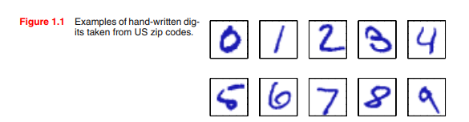
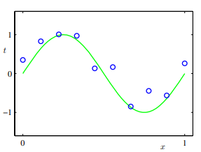
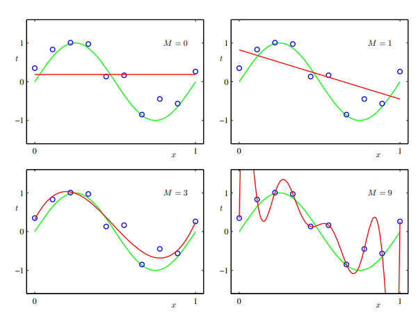

# "Mathematical notation" - các ký hiệu toán học dùng trong sách.
- Ông ấy (tác giả) đã thối thiểu hoá (minimum) các nội dung liên quan (sâu) đến toán,
tuy nhiên cấp độ tối thiểu khum phải là số ko, người đọc cần có kiến thức nền tảng
liên quan đến giải tích (caculus), đại số tuyến tính và lý thuyết xác suất để có thể hiểu rõ
các kỹ thuật về máy học và nhận dạng mẫu hiện đại.
- Ông ấy cố gắng thống nhất các ký hiệu toán xuyên suốt cuốn sách:
  - a.
    - Các vector được ký hiệu bằng chữ thường x, tất cả vector được giả định là vector cột. 
    Ký hiệu T trên đầu thì là vector dòng.
    - Chữ hoa in đậm M là ký cho ma trận.
    - Ký hiệu (w1,...,wM) là một vector dòng với M phần tử. 
    - w = (w1,...,wM)T  tương ứng vector cột.
  - b.
    - [a, b] là giá trị trong khoảng a -> b, bao gồm cả a, b.
    - (a, b) là giá trị trong khoảng a -> b, khum bao gồm cả a, b.
    - Tương tự cho [a, b), bao gồm a, khum bao gồm b.
    - Hau het cac phan, khong can phai tap trung vao viec các đầu mốc có được bao gồm hay không.
  - c
    - MxM ma trận đơn vị ký hiệu là IM.
    - Hàm ký hiệu là f[y], y là một hàm y(x) khác. Khái niệm hàm được thảo luận tại Appendix D.
    - Hiểu thức `g(x) = O(f(x))` biệu thị là `|f(x)/g(x)|` bị chặn bởi `x -> +Infinitive`.
    Ví dụ `g(x) = 3x^2 + 2` thì `g(x) = O(f(x^2))`.
    -> Liên quan đến khái niệm Big O, notation.

```
# Vocaburary:
departing: lạc đề, sao lãng
conventions: quy ước
corresponding: tương ứng
literature: tài liệu
```
# 1. INTRODUCTION
Tìm kiếm patterm (mẫu, quy luật) trong dữ liệu là một vấn đề cơ bản,
có một lịch sử lâu đời và thành công. Ví dụ
  - Các quan sát thiên văn mở rộng của Tycho Brahe vào thế kỷ 16 đã cho phép Johannes Kepler khám phá ra các quy luật thực nghiệm của
  chuyển động hành tinh, từ đó cung cấp bàn đạp cho sự phát triển của cơ học cổ điển.
  - Việc phát hiện ra các quy luật trong quang phổ nguyên tử đóng một vai trò quan trọng.
  vai trò quan trọng trong sự phát triển và xác minh vật lý lượng tử vào đầu thế kỷ XX.

Họ đưa ra các vấn đề cơ bản:
  - Nhận dạng chữ viết tay
    
  - **Dự đoán kết quả** của các điểm dữ liệu tuân theo 1 quy luật chưa biết (sin((2*pi*x))).

    
  
Họ đưa ra một số cách giải quyết cụ thể:
  - Đối với bài toán nhận dạng chữ viết tay, họ đưa dẫn chứng vì sao bài toán này khó.
  Vì sao các giải thuật Machine Learning có thể giải quyết vấn đề này 1 cách hiệu quả.
  Họ đưa ra các dạng mô hình ML: `supervise learning`, `un-supervised learning`, `reinforcement learning`. Và 1 số khái niệm
  liên quan `training-set` , `test-set`, `credit assignment problem`, `trade-off between exploration`.
  Họ giải thích Khi nào dùng dạng mô hình nào.

  - **Dự đoán kết quả**, họ đưa ra ví dụ cách giải, đưa ra các tham số, tên, ý nghĩa để
  , từ đó họ mô tả cách giải bài toán. Họ dẫn dắt đến 1 khái niệm quan trọng: 
  `model comparison or model selection`, `over-fitting`.

  

